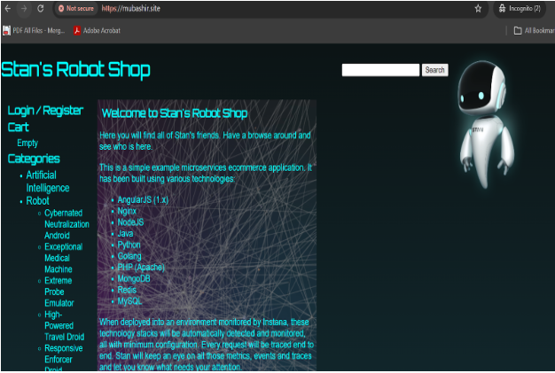

E-Commerce Platform — Microservice Application hosted on EKS with Istio

Overview:
A production-grade deployment of a three-tier e-commerce application on AWS EKS. The platform runs seven microservices (web, payment, user, cart, catalogue, shipping, ratings) across a fully automated infrastructure pipeline, with a service mesh for traffic management and zero-trust security, GitOps-driven deployments, and a complete observability stack.

Live Loom Demo Link: (https://www.loom.com/share/6a9283a627ac4616a5780a99c53f7aa7)

Architecture

Networking

VPC spans two availability zones (eu-west-2a, eu-west-2b)
Public subnets hold the ALB and NAT Gateways
Private subnets hold all EKS nodes — nodes have no public IP
Outbound internet access from nodes flows through the NAT Gateway (used for ECR pulls, Let's Encrypt ACME challenges, ArgoCD Git polling, and AWS API calls)
EKS control plane is AWS-managed and communicates with nodes via an ENI injected into the private subnets

Technology Stack

CloudAWS (EKS, ECR, Route 53, Secrets Manager, KMS, CloudTrail, SQS)
Infrastructure as Code:Terraform
Container orchestration:Kubernetes 1.28+
Package management:Helm
Service mesh:Istio
GitOps:ArgoCD
Observability:Prometheus, Grafana, Kiali, Jaeger
NodeAutoscaling:Karpenter
Certificate management:cert-manager (Let's Encrypt)
DNS management:external-dns
Secrets managements:External Secrets Operator + AWS Secrets Manager
AuthIRSA (IAM Roles for Service Accounts) via OIDC 
Image registry:Amazon ECR

Project Structure
roboshop-eks/
├── README.md
├── app/                          # Dockerfiles and docker-compose for local deployment
├── main.tf                       # Root Terraform configuration
├── variables.tf
├── outputs.tf
└── modules/
    ├── vpc/                      # VPC, subnets, IGW, NAT Gateway, route tables
    ├── security-groups/          # Cluster and node security group rules
    ├── eks/                      # EKS cluster, node groups, OIDC, add-ons
    ├── external-secrets/         # External Secrets Operator + SecretStore config
    ├── prometheus/               # Prometheus scrape config and values
    ├── external-dns/             # Route 53 DNS automation
    ├── cert-manager/             # Let's Encrypt certificate provisioning
    └── karpenter/                # Node autoscaling with AWS SQS interruption handling

Prerequisites

AWS CLI configured with appropriate credentials
Terraform >= 1.5
kubectl
Helm >= 3
Docker Engine (local deployment only)

Running Locally

git clone <https://github.com/MubashirHusain2005/roboshop-eks>
cd roboshop-eks/app
docker compose up -d

Deploying to AWS

1. Bootstrap remote state
cd terraform/bootstrap
terraform init
terraform plan
terraform apply

This provisions the S3 bucket used for Terraform remote state and also creates the base for the creation for my eks cluster.It creates the ecr repository, the IAM roles and polices for ECR, creates the KMS key for encryption of my ECR repos and most importantly the github oidc roles and and openid connect provider ready for when I deploy the application via CI/CD, OIDC is what allows github actions access to AWS resources. 

2. Deploy infrastructure
cd terraform/
terraform init
terraform plan
terraform apply

3. Configure kubectl
aws eks update-kubeconfig \
  --name eks-cluster \
  --region eu-west-2

# Verify access
kubectl get nodes
kubectl get namespaces
kubectl get pods -A

Modules

1.VPC:Provisions the network foundation for the cluster.

Internet Gateway for inbound public traffic to the ALB
NAT Gateway in each public subnet for outbound traffic from private subnets (ECR pulls, API calls, ACME challenges)
Public subnets tagged kubernetes.io/role/elb: 1 for ALB auto-discovery
Private subnets tagged kubernetes.io/role/internal-elb: 1
VPC Flow Logs shipped to CloudWatch for network audit trail

Security Groups
Two security groups control all traffic in and out of the cluster.
EKS Cluster SG — controls access to the Kubernetes API server. Allows inbound 443 from worker nodes only. Allows all outbound so the control plane can reach AWS services.
Worker Node SG — controls node-to-node and external-to-node traffic.

Ingress: all traffic from nodes within the same SG (required for pod-to-pod communication across nodes and for Istio mesh traffic)
Ingress: SSH on port 22 from VPC CIDR only (no public SSH access)
Egress: all outbound allowed (ECR pulls, AWS API calls, NAT Gateway)
Tagged for Karpenter node discovery

Control plane ↔ node rules

Nodes → control plane: port 443 (HTTPS to the API server)
Control plane → nodes: ephemeral ports 1024–65535 (API server-initiated connections back to kubelets)

2.IAM:

This module plays a heavy role behind how the services interact with each other, module contains the roles for my EKS cluster, the cluster needs to be able to create/manage services like Elastic Load Balancing and EC2, so without attaching the clusterpolicy, the cluster cant carry out basic functions.

2.EKS
Manages the Kubernetes cluster configuration.

Two node groups across availability zones 2a and 2b, each with a desired size of 2 nodes
Node affinity labels (role=app) ensure application pods are distributed evenly across nodes- done for high availability

OIDC provider configured for IRSA — allows pods to assume IAM roles without node-level credentials.Prevents the issue of over-permission escalation, pods only get the permissions they need and nothing more.

Kubernetes secrets encrypted at rest using KMS

Add-ons: 
kube-proxy, metrics-server, vpc-cni, coredns, ebs-csi-driver

EBS CSI Driver: enables Kubernetes to provision AWS EBS volumes for stateful workloads (databases). The driver's service account is bound to a dedicated IAM role via IRSA

VPC CNI: assigns VPC-native IPs directly to pods

aws-auth ConfigMap includes the Terraform IAM user and GitHub Actions role so both kubectl access and CI pipeline deployments work without being locked out.Definitely didnt learn this the hard way!!

3.External Secrets Operator (ESO)
Bridges AWS Secrets Manager and Kubernetes native secrets.
Kubernetes secrets are only base64-encoded, not encrypted, and hardcoding secret values in Terraform would expose them in source control. ESO solves this by treating AWS Secrets Manager as the source of truth.
Flow:

A SecretStore resource defines how to connect to AWS Secrets Manager (using IRSA for auth)
An ExternalSecret resource references a specific secret in Secrets Manager
ESO fetches the value and creates a native Kubernetes Secret object in the target namespace
ESO continuously reconciles — if the secret changes in Secrets Manager, it is automatically synced into the cluster on the next refresh interval

4.Prometheus

Collects metrics from the cluster and service mesh.

Scrapes Envoy sidecar metrics endpoints (:15090/stats/prometheus) on every pod automatically — no application instrumentation required

MySQL and Redis exporters connect to their respective services, collect database metrics, and expose them at /metrics

ServiceMonitor resources tell Prometheus which endpoints to scrape

Key Istio metrics collected: istio_requests_total, istio_request_duration_milliseconds, istio_request_bytes, istio_response_bytes

5.Grafana
Visualises metrics stored in Prometheus.

Pre-built Istio dashboards provide mesh-wide, per-service, and per-workload views
Kiali connects to Prometheus to render a live service topology map with traffic health indicators

6.Cert-manager
Automates TLS certificate provisioning from Let's Encrypt.

Uses DNS-01 ACME challenge: creates a acme-challenge TXT record in Route 53 to prove domain ownership, then deletes it after the certificate is issued
Requires Route 53 write permissions via IRSA
Certificates are automatically renewed before expiry

7.External-dns
Automates Route 53 record management.

Watches for Ingress and Service resources in the cluster.Automatically creates, updates, and deletes Route 53 A records to match — when the ALB Ingress comes up, external-dns creates the DNS record pointing to it
Requires Route 53 write permissions via IRSA

8.Karpenter
Replaces the Cluster Autoscaler with faster, more flexible node provisioning.This open-source tool:
Watches for pods stuck in Pending state due to insufficient capacity
Provisions a right-sized node within seconds rather than minutes
Uses Amazon SQS to receive EC2 spot interruption notices and drain nodes gracefully before termination
Consolidates underutilised nodes to reduce cost

9.ArgoCD: Gitops tool which acts as the source of truth and has the main task of continously syncing the manifests to the k8s cluster.

10.Istio-

IAM and Security
All pod-to-AWS authentication uses IRSA — no static credentials, no node-level IAM policies shared across all pods.
ComponentIAM permissionscert-managerroute53:ChangeResourceRecordSets, route53:ListHostedZones, route53:GetChangeexternal-dnsroute53:ChangeResourceRecordSets, route53:ListHostedZones, route53:ListResourceRecordSetsExternal Secrets Operatorsecretsmanager:GetSecretValue, secretsmanager:DescribeSecretEBS CSI Driverec2:CreateVolume, ec2:AttachVolume, ec2:DeleteVolume and relatedKarpenterEC2 provisioning and SQS permissions

Observability
The observability stack is built on data emitted by Istio's Envoy sidecars — no application code changes needed.
Envoy sidecar (every pod)
 └── exposes metrics at :15090/stats/prometheus
      └── Prometheus scrapes on 15s interval
           ├── Grafana queries Prometheus → dashboards and alerting
           └── Kiali queries Prometheus → live service map and traffic health
Kiali also reads Kubernetes API and Istio config directly to surface VirtualService/DestinationRule misconfigurations alongside live traffic data.

<Add kiali map pic here>

Planned Improvements:

 Run all my containers as non-root users
 Persistent storage for Prometheus metrics (currently lost on pod restart)
 Thanos for Prometheus high availability and long-term storage (prevents duplicate scraping across replicas)
 PeerAuthentication: STRICT mesh-wide to enforce mTLS between all services
 AuthorizationPolicy per service to restrict which services can call which
 AWS WAF on the ALB 

