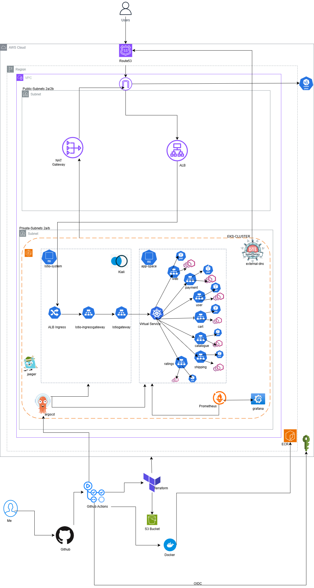
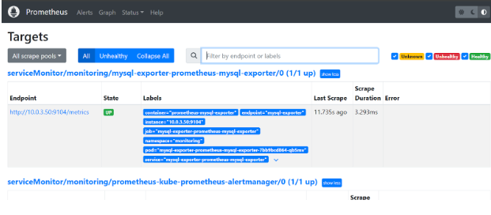
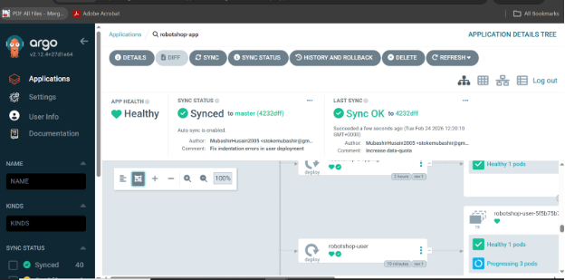

# E-Commerce Platform on AWS EKS with Istio

A production-grade deployment of a three-tier e-commerce application on AWS EKS, featuring a full GitOps pipeline, service mesh, and observability stack. 

> 🎥 [Watch the Loom Demo](https://www.loom.com/share/6a9283a627ac4616a5780a99c53f7aa7)

---

## Overview

The platform runs seven microservices (web, payment, user, cart, catalogue, shipping, ratings) across a fully automated infrastructure pipeline with:

- **Zero-trust security** via Istio service mesh and IRSA
- **GitOps deployments** driven by ArgoCD
- **Full observability** with Prometheus, Grafana, Kiali, and Jaeger
- **Dynamic node autoscaling** via Karpenter

---

## Architecture



---

## Technology Stack

| Category | Technology |
|---|---|
| **Cloud** | AWS (EKS, ECR, Route 53, Secrets Manager, KMS, CloudTrail, SQS) |
| **Infrastructure as Code** | Terraform |
| **Container Orchestration** | Kubernetes 1.28+ |
| **Package Management** | Helm |
| **Service Mesh** | Istio |
| **GitOps** | ArgoCD |
| **Observability** | Prometheus, Grafana, Kiali, Jaeger |
| **Node Autoscaling** | Karpenter |
| **Certificate Management** | cert-manager (Let's Encrypt) |
| **DNS Management** | external-dns |
| **Secrets Management** | External Secrets Operator + AWS Secrets Manager |
| **Auth** | IRSA via OIDC |
| **Image Registry** | Amazon ECR |

---

## Project Structure

```
roboshop-eks/
├── .github\workflows
     ├── push-image.yml         #Pipeline to push images to ECR
     ├── terraform.yml          # Pipeline to run terraform plan/apply/destroy
├── README.md
├── app/                    # Dockerfiles and docker-compose for local deployment
├── images/ 
├── robotshop-application/ 
    ├── charts/                
    ├── templates/ 
        ├── destinationrule.yaml
        ├── istio.yml
        ├── manifests.yml
        ├── mtls.yml
        ├── services.yml
        ├── storage.yml                 
    ├── .helmignore/                
    ├── cert-manager-values.yaml               
    ├── eso-values.yaml         
    ├── istiod-values.yaml       
    ├── karpenter-values.yaml       
    ├── nginx-values.yaml          
    ├── prometheus-values.yaml             
├── terraform/
    └── bootstrap/
        ├── main.tf
        ├── variables.tf
        ├── outputs.tf
    └── modules/
        ├── vpc/                # VPC, subnets, IGW, NAT Gateway, route tables
        ├── istio/              # Cluster and node security group rules
        ├── eks/                # EKS cluster, node groups, OIDC, add-ons
        ├── eso/                # External Secrets Operator + SecretStore config
        ├── monitoring/         # Prometheus + Grafana configuration for observability
        ├── external-dns/       # Route 53 DNS automation
        ├── cert-manager/       # Let's Encrypt certificate provisioning
        ├── karpenter/          # Node autoscaling with SQS interruption handling
        ├── iam/                # Roles and policies for cluster and nodes
        └── argocd/             # GitOps deployment configuration
├── main.tf                     # Root Terraform configuration
├── variables.tf
├── outputs.tf
```

---

## Getting Started

### Prerequisites

- AWS CLI configured with appropriate credentials
- Terraform >= 1.5
- kubectl
- Helm >= 3
- Docker Engine (local deployment only)

### Run Locally

```bash
git clone https://github.com/MubashirHusain2005/roboshop-eks
cd roboshop-eks/app
docker compose up -d
```

### Deploy to AWS

**1. Bootstrap remote state**

```bash
cd terraform/bootstrap
terraform init && terraform plan && terraform apply
```

This provisions the S3 bucket for Terraform remote state, ECR repositories, IAM roles, a KMS key for ECR encryption, and the GitHub OIDC provider for CI/CD access to AWS.

**2. Deploy infrastructure**

```bash
cd terraform/
terraform init && terraform plan && terraform apply
```

**3. Configure kubectl**

```bash
aws eks update-kubeconfig \
  --name eks-cluster \
  --region eu-west-2

# Verify access
kubectl get nodes
kubectl get namespaces
kubectl get pods -A
```

---

## Infrastructure Modules

### VPC

Provisions the network foundation for the cluster.

- **Internet Gateway** for inbound public traffic to the ALB
- **NAT Gateway** per public subnet for outbound traffic from private subnets (ECR pulls, API calls, ACME challenges)
- Public subnets tagged `kubernetes.io/role/elb: 1` for ALB auto-discovery
- Private subnets tagged `kubernetes.io/role/internal-elb: 1`
- VPC Flow Logs shipped to CloudWatch for network audit

**Security Groups**

| Group | Purpose |
|---|---|
| EKS Cluster SG | Controls access to the Kubernetes API. Allows inbound 443 from worker nodes only. |
| Worker Node SG | Controls node-to-node and external-to-node traffic. Allows pod-to-pod communication and Istio mesh traffic. |

**Control Plane ↔ Node Rules**

- Nodes → control plane: port 443
- Control plane → nodes: ephemeral ports 1024–65535

---

### IAM

Defines all roles and policies governing how services interact. The cluster role allows EKS to manage services like ELB and EC2. All pod-to-AWS auth uses **IRSA** — no static credentials, no shared node-level policies.

| Component | Permissions |
|---|---|
| cert-manager | `route53:ChangeResourceRecordSets`, `ListHostedZones`, `GetChange` |
| external-dns | `route53:ChangeResourceRecordSets`, `ListHostedZones`, `ListResourceRecordSets` |
| External Secrets Operator | `secretsmanager:GetSecretValue`, `DescribeSecret` |
| EBS CSI Driver | `ec2:CreateVolume`, `AttachVolume`, `DeleteVolume` + related |
| Karpenter | EC2 provisioning and SQS permissions |

---

### EKS

- Two node groups across AZs `eu-west-2a` and `eu-west-2b`, each with a desired size of 2 nodes
- Node affinity labels (`role=app`) distribute pods evenly for high availability
- OIDC provider configured for IRSA — pods assume IAM roles without node-level credentials
- Kubernetes secrets encrypted at rest using KMS
- `aws-auth` ConfigMap includes both the Terraform IAM user and the GitHub Actions role

**Add-ons:** `kube-proxy`, `metrics-server`, `vpc-cni`, `coredns`, `ebs-csi-driver`

---

### External Secrets Operator (ESO)

Bridges AWS Secrets Manager with Kubernetes-native secrets. Kubernetes secrets are only base64-encoded — ESO makes AWS Secrets Manager the source of truth.

**Flow:**
1. A `SecretStore` defines how to connect to AWS Secrets Manager (via IRSA)
2. An `ExternalSecret` references a specific secret in Secrets Manager
3. ESO creates a native Kubernetes `Secret` in the target namespace
4. ESO continuously reconciles — secrets sync automatically on each refresh interval

---

### Monitoring

**Prometheus** collects metrics from the cluster and service mesh.

- Scrapes Envoy sidecar metrics at `:15090/stats/prometheus` on every pod — no app instrumentation required
- MySQL and Redis exporters expose database metrics at `/metrics`
- `ServiceMonitor` resources define which endpoints to scrape
- Key Istio metrics: `istio_requests_total`, `istio_request_duration_milliseconds`, `istio_request_bytes`



**Grafana** visualises metrics from Prometheus.

- Pre-built Istio dashboards for mesh-wide, per-service, and per-workload views
- Kiali renders a live service topology map with traffic health indicators

---

### Cert-manager

Automates TLS certificate provisioning from Let's Encrypt using the **DNS-01 ACME challenge** — creates a `_acme-challenge` TXT record in Route 53 to prove domain ownership, then deletes it after issuance. Certificates renew automatically before expiry.

---

### external-dns

Watches for `Ingress` and `Service` resources and automatically creates, updates, and deletes Route 53 A records to match. When the ALB Ingress comes up, external-dns creates the DNS record pointing to it.

---

### Karpenter

Replaces the Cluster Autoscaler with faster, more cost-efficient node provisioning.

- Watches for `Pending` pods caused by insufficient capacity
- Provisions a right-sized node within seconds
- Receives EC2 Spot interruption notices via SQS and drains nodes gracefully
- Consolidates underutilised nodes to reduce cost

---

### ArgoCD

GitOps controller that acts as the source of truth for cluster state. Continuously syncs manifests from the Git repository to the Kubernetes cluster.



---

### Istio

Istio acts as a service mesh which visualizes how traffic moves in a microservice based application, using envoy proxies 

## Observability Pipeline

No application code changes are needed — all telemetry flows from Istio's Envoy sidecars.

```
Envoy sidecar (every pod)
  └── :15090/stats/prometheus
       └── Prometheus (15s scrape interval)
            ├── Grafana  → dashboards + alerting
            └── Kiali    → live service map + traffic health
```

Kiali also reads the Kubernetes API and Istio config directly to surface `VirtualService` / `DestinationRule` misconfigurations alongside live traffic data.

---

## Stats

- 🚀 **20% reduction** in deployment time via CI/CD pipelines
- 📦 **35% reduction** in image size using multi-stage builds and Alpine base images

---

## Planned Improvements

- [ ] Run all containers as non-root users to reduce attack surface
- [ ] Persistent storage for Prometheus metrics (currently lost on pod restart)
- [ ] Thanos for Prometheus HA and long-term storage
- [ ] `PeerAuthentication: STRICT` mesh-wide to enforce mTLS between all services
- [ ] `AuthorizationPolicy` per service to restrict inter-service calls
- [ ] AWS WAF on the ALB


